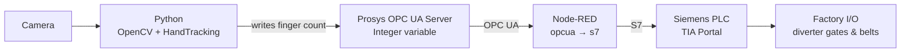

# PLC_ComputerVision — Gesture-Controlled Package Sorting

A real-time **Industry 4.0** demo that controls an industrial sorting process using **hand-gesture recognition**. A computer-vision pipeline counts the number of raised fingers in front of a camera and, based on that number, commands a Siemens PLC to open the corresponding diverter gate — routing packages onto different conveyor belts inside a **Factory I/O** simulation.

The project demonstrates **IT/OT convergence**: the vision layer (Python) talks to the control layer (Siemens PLC) through a **Prosys OPC UA** server and a **Node-RED** bridge that translates OPC UA into the Siemens **S7** protocol.

🎥 **Demo video:** https://www.youtube.com/watch?v=EkICnDUIZXo

## How it works



1. A camera captures the operator's hand in real time.
2. **OpenCV + a hand-tracking module** detect the hand and count the number of extended fingers.
3. The Python OPC UA client writes the finger count into an **Integer variable on the Prosys OPC UA server**.
4. **Node-RED** reads that value over OPC UA (`node-red-contrib-opcua`) and writes it to the PLC over S7 (`node-red-contrib-s7`).
5. The PLC logic (**TIA Portal**) opens the matching diverter gate, and **Factory I/O** routes the package onto the selected conveyor belt.

## Tech stack

| Layer | Technologies |
| --- | --- |
| Computer vision | Python, OpenCV, MediaPipe (hand tracking) |
| OPC UA server | Prosys OPC UA Simulation Server |
| Integration bridge | Node-RED (`node-red-contrib-opcua`, `node-red-contrib-s7`) |
| PLC / control | Siemens PLC (TIA Portal), S7 protocol |
| Process simulation | Factory I/O |

## Repository structure

| Folder | Description |
| --- | --- |
| `computer-vision/` | Python vision app — hand detection, finger counting, OPC UA client |
| `ops_server/` | Server-side / integration configuration (OPC UA, Node-RED) |
| `tia-portal/` | Siemens PLC program (TIA Portal project) |
| `factory-io/` | Factory I/O scene and simulation files |

## Getting started

### Prerequisites

- Python 3.10+ and a working camera
- [Siemens TIA Portal](https://www.siemens.com) (to run the PLC project / PLCSIM)
- [Factory I/O](https://factoryio.com) (process simulation)
- [Prosys OPC UA Simulation Server](https://prosysopc.com)
- [Node-RED](https://nodered.org/docs/getting-started/windows)

### Python packages

```bash
pip install opcua opencv-python mediapipe
```

> The project also uses a local `HandTrackingModule` (built on MediaPipe) plus the standard
> library modules `time`, `os` and `sys`.

### Node-RED packages

Install from the Node-RED palette manager or via npm:

- `node-red-contrib-opcua`
- `node-red-contrib-s7`

### Setup & run

1. **PLC** — load the TIA Portal project onto the PLC (or PLCSIM) so the relevant output is activated by the incoming value.
2. **Prosys** — create the Integer variable that the vision app will write the finger count to.
3. **Python** — adjust the OPC UA endpoint / node ID in the vision code to match your Prosys variable, then run it.
4. **Node-RED** — open the flow, map the OPC UA input and the S7 output to your Prosys variable and PLC address.
5. **Connect & execute** — start all components, show your hand to the camera, and watch the packages get routed in Factory I/O.

## Possible improvements

- Replace finger counting with a trained gesture-classification model for more robust control.
- Add an HMI/dashboard for live status and logging.
- Containerize the vision + integration components for easier deployment.

## Author

**Grzegorz Czyrniański** — Application Developer @ JUMO
Industrial automation · Computer vision · Industry 4.0
