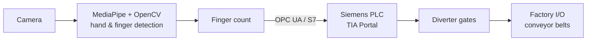

# PLC_ComputerVision — Gesture-Controlled Package Sorting

A real-time **Industry 4.0** demo that controls an industrial sorting process using **hand-gesture recognition**. A computer-vision pipeline counts the number of raised fingers in front of a camera and, based on that number, commands a Siemens PLC to open the corresponding diverter gate — routing packages onto different conveyor belts inside a **Factory I/O** simulation.

The project bridges the **IT layer** (Python computer vision) and the **OT layer** (PLC control) through **OPC UA** and the Siemens **S7** protocol — a practical example of IT/OT convergence in Industry 4.0.

## How it works



1. A camera captures the operator's hand in real time.
2. **MediaPipe + OpenCV** detect the hand and count the number of extended fingers.
3. The finger count is sent to the Siemens PLC via **OPC UA / S7**.
4. The PLC logic (developed in **TIA Portal**) opens the matching diverter gate.
5. In **Factory I/O**, packages are routed onto the selected conveyor belt.

## Tech stack

| Layer | Technologies |
| --- | --- |
| Computer vision | Python, MediaPipe, OpenCV |
| Communication | OPC UA, Siemens S7 |
| PLC / control | Siemens PLC (TIA Portal) |
| Process simulation | Factory I/O |

## Repository structure

| Folder | Description |
| --- | --- |
| `computer-vision/` | Computer-vision application — hand detection and finger counting |
| `ops_server/` | Communication layer (OPC UA / S7) between the vision app and the PLC |
| `tia-portal/` | Siemens PLC program (TIA Portal project) |
| `factory-io/` | Factory I/O scene and simulation files |

## Getting started

### Requirements

- Python 3.10+
- A working webcam
- Siemens TIA Portal (to open / run the PLC project)
- Factory I/O (to run the process simulation)

### Installation

```bash
git clone https://github.com/grzegorzczy/PLC_ComputerVision.git
cd PLC_ComputerVision/computer-vision
python -m venv venv_plc
venv_plc\Scripts\activate        # Windows
# source venv_plc/bin/activate   # Linux / macOS
pip install -r requirements.txt
```

### Running

1. Open the PLC project in **TIA Portal** and download it to the PLC (or PLCSIM).
2. Open the scene in **Factory I/O** and connect it to the PLC.
3. Start the OPC UA / S7 server layer in `ops_server/`.
4. Run the vision application from `computer-vision/` and show your hand to the camera.

## Possible improvements

- Replace finger counting with a trained gesture-classification model for more robust control.
- Add a small HMI/dashboard for live status and logging.
- Containerize the vision + server components for easier deployment.

## Author

**Grzegorz Czyrniański** — Application Developer @ JUMO
Industrial automation · Computer vision · Industry 4.0
